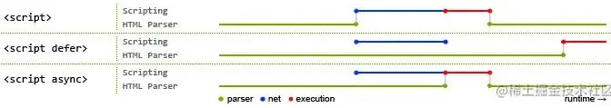

## js加载方式
### 正常模式
> 默认情况下，浏览器是同步加载js脚本，浏览器会立即加载并执行相应的脚本，这种情况下js会阻塞dom渲染。如果脚本体积很大，下载和执行的时间就会很长，因此造成浏览器堵塞，用户会感觉到浏览器“卡死”了，没有任何响应。

```
<script src="index.js"></script>
```
### async模式
> async模式下js加载是异步的，js加载不会阻塞dom渲染，async加载是无顺序的，当js加载结束会立即执行，渲染引擎就会中断渲染，执行这个脚本以后，再继续渲染。

```
<script async src="index.js"></script>
```
#### 使用场景
- 若该js资源与dom元素没有依赖关系，也不会产生其他资源所需要的数据时，可以使用async模式，比如埋点统计。
### defer 模式
> defer模式下，js的加载也是异步的，资源会在DOMContentLoaded执行之前，并且defer是有顺序的加载，如果有多个设置了defer的script标签存在，则会按照引入的前后顺序执行，即便是后面的script资源先返回。

```
<script defer src="index.js"></script>
```
#### 使用场景
> 一般情况下都可以使用 defer，特别是需要控制资源加载顺序时。

- 比如element-ui.js和 vue.js，因为element-ui.js依赖于vue，所以必须先引入vue.js，再引入element-ui.js。
```
<script defer src="vue.js"></script>
<script defer src="element-ui.js"></script>
```
### module模式
> 在主流的现代浏览器中，script标签的属性可以加上type="module"，浏览器会对其内部的import引用发起HTTP请求获取模块内容。这时script的行为会像defer模式一样，在后台下载并且等待DOM解析。

```
<script type="module">
  import { a } from './a.js';
</script>
```
#### 使用场景
- Vite就是利用浏览器支持原生的es module模块，开发时跳过打包的过程，提升编译效率。

### preload
> link标签的preload属性用于提前加载一些需要的依赖，这些资源会优先加载。

```
<link rel="preload" as="script" href="index.js">
```
#### 特点
- preload加载的资源是在浏览器渲染机制之前进行处理的，并且不会阻塞onload事件。
- preload加载的js脚本其加载和执行的过程是分离的，即preload会预加载相应的脚本代码，待到需要时自行调用。
### prefetch
> prefetch是利用浏览器的空闲时间，加载页面将来可能用到的资源的一种机制。通常可以用于加载其他页面（非首页）所需要的资源，以便加快后续页面的打开速度。

```
<link rel="prefetch" as="script" href="index.js">
```
#### 特点
- prefetch加载的资源可以获取非当前页面所需要的资源，并且将其放入缓存至少5分钟（无论资源是否可以缓存）。
- 当页面跳转时，未完成的prefetch请求不会被中断。
### 总结
- async、defer是script标签的专属属性，对于网页中的其他资源，可以通过link的preload、prefetch属性来预加载。
### defer与async
> defer和async属性都是异步加载外部的js脚本文件，它们都不会阻塞页面的解析。defer是渲染完再执行，async是下载完就执行。


