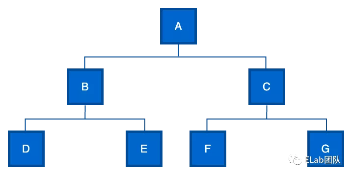
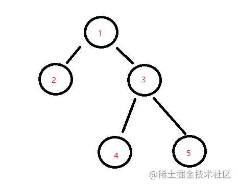

## 树
> 树是一种数据结构，它是由 n(n>=1)个有限节点组成一个具有层次关系的集合。把它叫做“树”是因为它看起来像一棵倒挂的树，也就是说它是根朝上，而叶朝下的。

- 无序树：树中任意节点的子结点之间没有顺序关系，这种树称为无序树,也称为自由树。
- 有序树：树中任意节点的子结点之间有顺序关系，这种树称为有序树。
- 二叉树：每个节点最多含有两个子树的树称为二叉树。
- 满二叉树：叶节点除外的所有节点均含有两个子树的树被称为满二叉树。
- 完全二叉树：除最后一层外，所有层都是满节点，且最后一层缺右边连续节点的二叉树称为完全二叉树（堆就是一个完全二叉树）。
- 哈夫曼树（最优二叉树）：带权路径最短的二叉树称为哈夫曼树或最优二叉树。
### 二叉树


```
function Node(data) {
  this.data = data;
  this.left = null;
  this.right = null;
}

const nodeA = new Node('A');
const nodeB = new Node('B');
const nodeC = new Node('C');
const nodeD = new Node('D');
const nodeE = new Node('E');
const nodeF = new Node('F');
const nodeG = new Node('G');

nodeA.left = nodeB;
nodeA.right = nodeC;
nodeB.left = nodeD;
nodeB.right = nodeE;
nodeC.left = nodeF;
nodeC.right = nodeG;
```
### 深度优先遍历
> 尽可能深的搜索树的分支,就比如遇到一个节点就会直接去遍历他的子节点，不会立刻去遍历他的兄弟节点。

- 访问根节点
- 对根节点的 children 挨个进行深度优先遍历
```
const dfs = (tree) => {
  tree.children.forEach(dfs)
};
```
### 广度优先遍历
> 先访问离根节点最近的节点, 如果有兄弟节点就会先遍历兄弟节点，再去遍历自己的子节点。

- 新建一个队列 并把根节点入队
- 把队头出队并访问
- 把队头的children挨个入队
- 重复第二 、三步 直到队列为空
```
const bfs = (tree) => {
  const q = [tree];
  while (q.length > 0) {
    const n = q.shift()
    console.log(n.val);
    n.children.forEach(c => q.push(c))
  }
};
```
#### 二叉树层序遍历

```
// 需要返回 [[1], [2,3], [4,5]]


// 时间复杂度 O(n) n为树的节点数
// 空间复杂度 O(n) 
var levelOrder = function (root) {
  if (!root) return []
   
  // 广度优先遍历
  const q = [root];
  const res = [];
  while (q.length) {
    let len = q.length
    res.push([])
    // 循环每层的节点数量次
    while (len--) {
      const n = q.shift();
      res[res.length - 1].push(n.val)
      if (n.left) q.push(n.left);
      if (n.right) q.push(n.right);
    }
  }
  return res
};
```